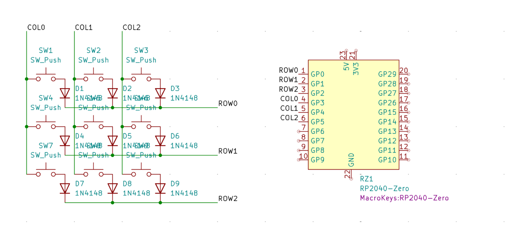
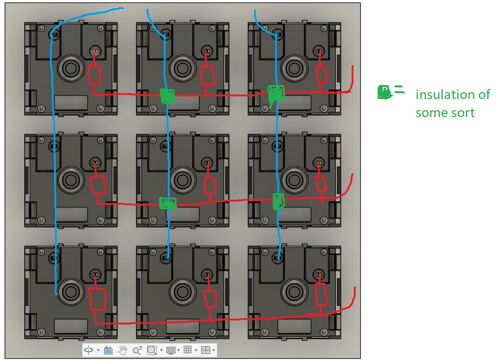

# macro9000
a compact hand wired macropad!
macro9000 is a 9 key rp2040 and qmk based customisable macropad! it can be made without needing to manufacture a pcb! 
it also modularly attaches via trrs cable and uart, with splitkey9000, my hand wired split keyboard... (wip)

### inspiration
every macropad i see has a pcb attached to it. i dont see the need for it to be honest. so i decided to make my own hand wired macropad.

### features:
* 9 customisable keys (with a webtool called via)
* qmk firmware
* fully hand wired, no pcb
* a clean look, with the keys spanning the entirety of the surface

### bom:

|component   |use                                                            |qty            |price     |link                                                                                    ||
|------------|---------------------------------------------------------------|---------------|----------|----------------------------------------------------------------------------------------|------|
|RP2040-Zero |main microcontroller running qmk                               |1              |269       |https://robu.in/product/rp2040-zero-for-raspberry-pi-microcontroller-with-soldering/    |      |
|1n4148 diode|reduce ghosting                                                |9              |30        |https://robu.in/product/1n4148-onsemi-100v-1v10ma-4ns-200ma-do-35-switching-diodes-rohs/|      |
|MX Switches |well, switches                                                 |9 (pack of 10) |~250      |TBD                                                                                     |      |
|Keycaps     |3d Printed keycaps                                             |9              |~100      |probably robu service                                                                   |      |
|Wire        |wiring lmao (the wire ive chosen is soo good... tins so easily)|2m (to be safe)|30        |https://robu.in/product/24awg-silicone-braided-wire-red/                                |      |
|casing      |3d printed casing                                              |1              |~300      |probably robu service                                                                   |      |
|shipping    |cart values gonna be low so shipping needed lol                |               |~200 total|                                                                                        |      |
|total       |                                                               |               |~1150     |                                                                                        |      |
|            |                                                               |               |12 usd    |                                                                                        |      |
|            |                                                               |               |          |                                                                                        |      |

### 3d printing
the enclosure and the keycaps are 3d printed. files can be found inside the [3d files](3d_files) folder. I have attached a [3d print arranged file](3d_files/3dpassem.step), you can upload that to a slicer and print!

### schematic and wiring
this is the main schematic to use while wiring..

switches should be wired after fitting into the sockets like:

### how to build
* 3d print the case, socket and 9 keycaps. you can use this [file](3d_files/3dpassem.step), directly upload it to the slicer, and print. high quality (0.1mm) is preffered.
* push the mx keys into the slots on the socket. its square, so doesnt matter which way. but for easy wiring, place all the 2 pin sides on the same side (as shown in the wiring diagram)
* solder the diodes, and the wires acc to the wiring diagram, make sure that the leg opposite to the black stripe is connected to the switch leg.
* mount the rp2040 zero in the box, and make the connections acc to the schematic
* mount the trrs female in the box and make its connections too (wip)
* place the socket over the box
* flash the firmware and youre good to go!

